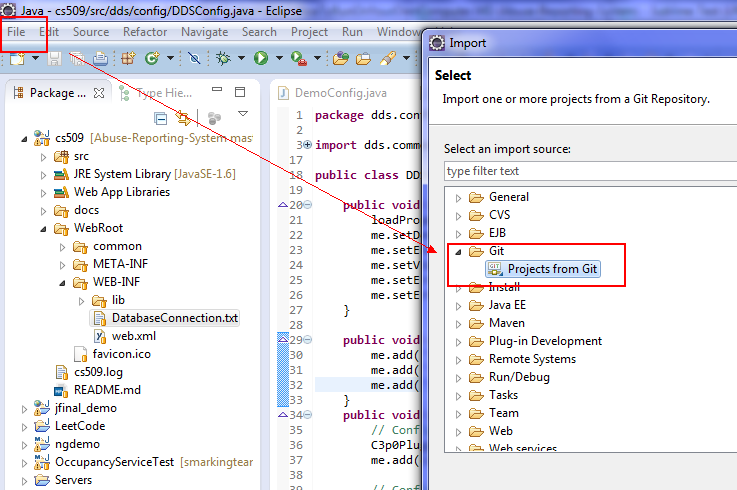
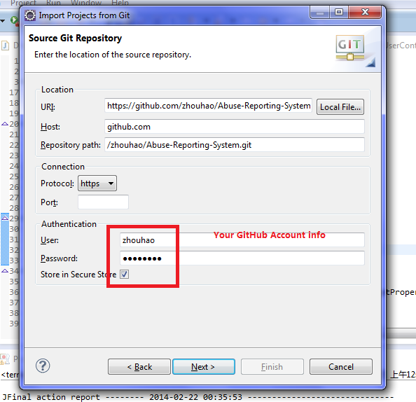
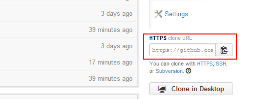
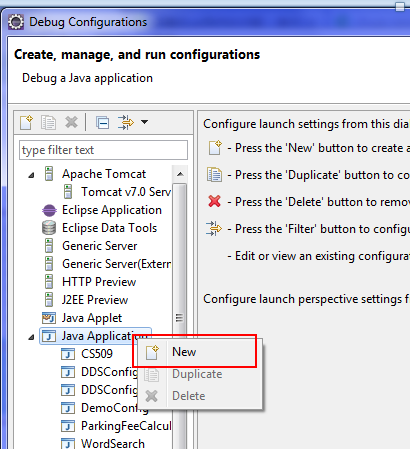
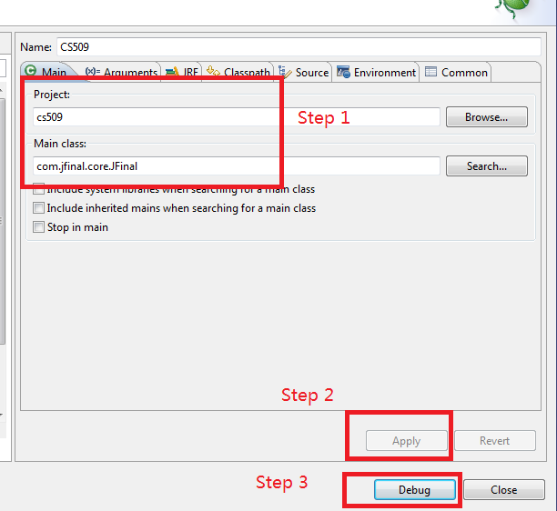
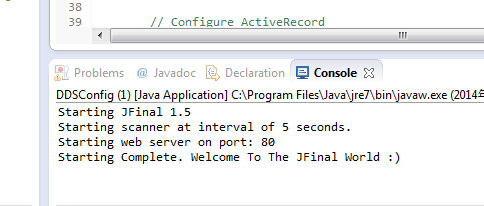
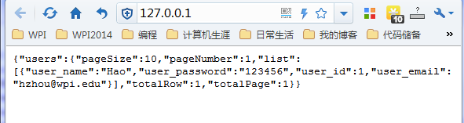
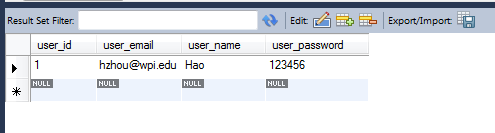

###prerequisite:
1. JDK with JRE (>=1.6 Recommend)    
2. Tomcat is **not** a necessary, and I recommend to use **Jetty**(Tomcat is totally fine).     

###Import it from Git to your Eclipse
1. Download [Eclipse IDE for Java EE Developers](https://www.eclipse.org/downloads/), and "install" it.   
2. Open Eclipse, Open "File->Import->Git->Project from Git->Clone URI", then click "Next" and "Next" with default setting, until you "finish" it.    
    

The "URI" comes from GitHub page, you can find it here(different accounts have different URIs, just copy & paste it):   

###Run it locally
1. Right click project "cs509[Abuse-Reporting-System]", "Debug AS->Debug Configration", then following the images below:    
    

2. If everything is OK, after "Debug" being clicked, the server should run as below:   
     
3. Open your favorite browser, then input "localhost" or "127.0.0.1" (BTW: you'd better know the difference between these 2. The latter is recommended, even most demo use "localhost"), then it will comes the image below:     
      

4. The result is coming from the database:     
    

###If you have any question, please contact me hzhou@wpi.edu, or add an issue for this project. I will reply it as soon as I see it.   

